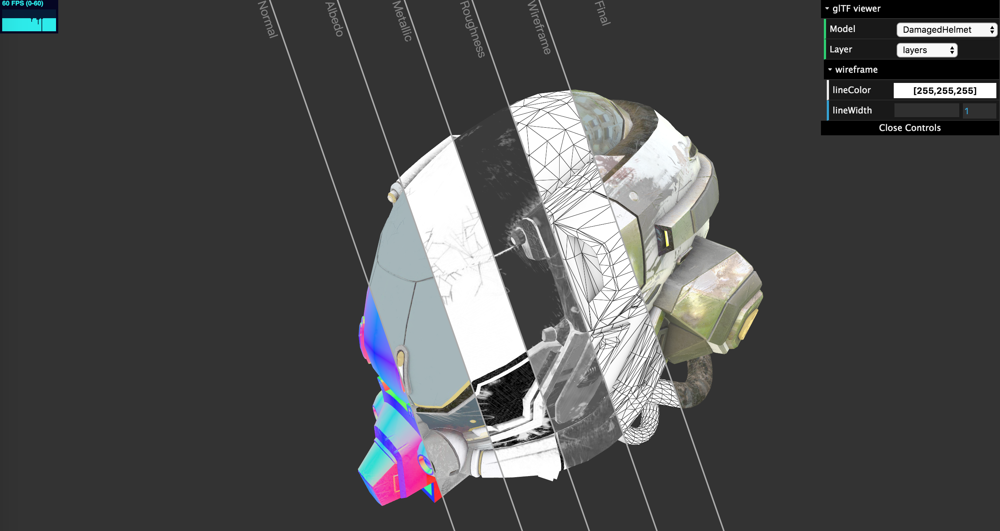

# a-simple-gltf-viewer

Just a simple glTF viewer inspired by: 
* [glTF-WebGL-PBR](https://github.com/KhronosGroup/glTF-WebGL-PBR/)
* [clay-viewer](https://pissang.github.io/clay-viewer/editor/)
* [MARMOSET VIEWER](https://marmoset.co/viewer/).

[](https://xiaoiver.github.io/a-simple-gltf-viewer/)

Features:
* PBR in glTF 2.0
* Use [Regl](https://github.com/regl-project/regl/) to handle WebGL stuffs.
* Use [InversifyJS](https://github.com/inversify/InversifyJS) as an IoC container.
* Use [gltf-loader-ts](https://github.com/bwasty/gltf-loader-ts/) to load glTF models.
* Also based on [electron-react-typescript-webpack-boilerplate](https://github.com/Devtography/electron-react-typescript-webpack-boilerplate).

TODO:
* Support [skin](https://github.com/KhronosGroup/glTF/tree/master/specification/2.0#skin).
* Timeline & [animation](https://github.com/KhronosGroup/glTF/tree/master/specification/2.0#animations).
* Support [Camera](https://github.com/KhronosGroup/glTF/tree/master/specification/2.0#cameras).
* Soft Shadow
* Use some PWA features to cache glTF model.
* Add more post-processing such as FXAA.
* Support drag & drop when uploading glTF model.
* Handle [context loss](https://github.com/regl-project/regl/blob/gh-pages/API.md#context-loss).

## Getting started

Then install all the `node_modules` needed by executing the following command:
```bash
npm run install
```

Finally execute the following command to start Webpack in development mode and 
watch the changes on source files.
```bash
npm run dev
```

## Building the installer for your Electron app
The boilerplate is currently configured to package & build the installer of 
your app for macOS & Windows using `electron-builder`. 

For macOS, execute:
```bash
npm run build:mac
```

For Windows, execute:
```bash
npm run build:win
```
_** `asar` archiving is disabled by default in Windows build as it can cause 
errors while running the installed Electron app based on pervious experiences, 
whereas the macOS build with `asar` enabled works just fine. You can turn it 
back on by removing line 23 (`"asar": false`) in `package.json`. **_

### Extra options
The build scripts are pre-configured to build 64 bit installers since 64 bit 
should be the standard for a modern applications. 32 bit builds are still 
possible by changing the build scripts in `package.json` as below:
```json
// from
"scripts": {
    ...
    "build:win": "electron-builder build --win --x64",
    "build:mac": "electron-builder build --mac --x64"
},

// to
"scripts": {
    ...
    "build:win": "electron-builder build --win --ia32",
    "build:mac": "electron-builder build --mac --ia32"
},
```

Builds for Linux, armv71, and arm64 can also be configured by modifying the 
build scripts in `package.json`, but those aren't tested yet. For details, 
please refer to [documents of `electron-builder`](https://www.electron.build/cli).

## License
[licensed as MIT](LICENSE).
